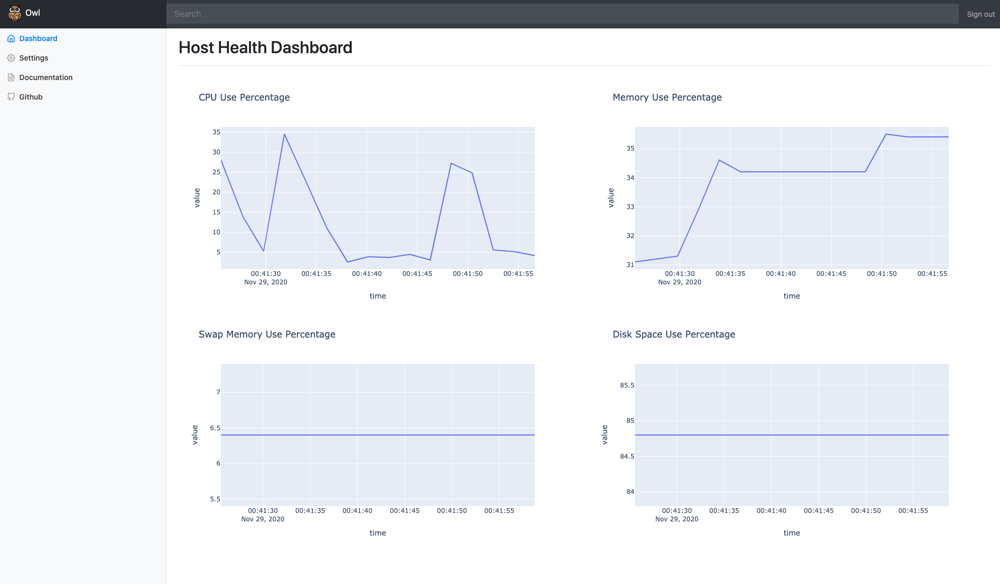
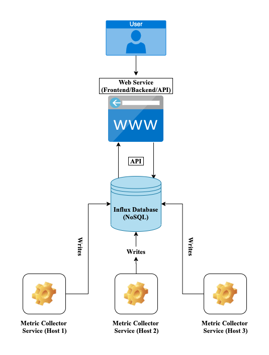

<!-- PROJECT SHIELDS -->
<!--
*** I'm using markdown "reference style" links for readability.
*** Reference links are enclosed in brackets [ ] instead of parentheses ( ).
*** See the bottom of this document for the declaration of the reference variables
*** for contributors-url, forks-url, etc. This is an optional, concise syntax you may use.
*** https://www.markdownguide.org/basic-syntax/#reference-style-links
-->
[![Contributors][contributors-shield]][contributors-url]
[![Forks][forks-shield]][forks-url]
[![Stargazers][stars-shield]][stars-url]
[![Issues][issues-shield]][issues-url]
[![MIT License][license-shield]][license-url]
[![LinkedIn][linkedin-shield]][linkedin-url]

[](https://app.circleci.com/pipelines/github/cisc6597/owl)


<!-- PROJECT LOGO -->
<br />
<p align="center">
  <a href="https://github.com/cisc6597/owl">
    
  </a>

  <h3 align="center">Owl</h3>

  <p align="center">
    A monitoring tool suite for your fleet of hosts, that include a collector and a web service UI. Basic features are currently implemented in its current state, and more to come!
    <br />
    <a href="https://github.com/cisc6597/owl"><strong>Explore the docs »</strong></a>
    <br />
    <br />
    <a href="https://github.com/cisc6597/owl/issues">Report Bug</a>
    ·
    <a href="https://github.com/cisc6597/owl/issues">Request Feature</a>
  </p>
</p>


<!-- TABLE OF CONTENTS -->
<details open="open">
  <summary><h2 style="display: inline-block">Table of Contents</h2></summary>
  <ol>
    <li>
      <a href="#about-the-project">About The Project</a>
      <ul>
        <li><a href="#built-with">Built With</a></li>
      </ul>
    </li>
    <li>
      <a href="#getting-started">Getting Started</a>
      <ul>
        <li><a href="#prerequisites">Prerequisites</a></li>
        <li><a href="#installation">Installation</a></li>
      </ul>
    </li>
    <li><a href="#usage">Usage</a></li>
    <li><a href="#roadmap">Roadmap</a></li>
    <li><a href="#contributing">Contributing</a></li>
    <li><a href="#license">License</a></li>
    <li><a href="#contact">Contact</a></li>
    <li><a href="#acknowledgements">Acknowledgements</a></li>
  </ol>
</details>


<!-- ABOUT THE PROJECT -->
## About The Project



This project was originally created as a project for the author's Computer Science Capstone course. This tool suite combines a metrics collector that can be placed on a host to continuously send metrics to a InfluxDB data store, and a web service that can be used as a simplified monitoring dashboard.


### Built With

* [Python](https://www.python.org/)
* [Django](https://www.djangoproject.com/)
* [Bootstrap](https://getbootstrap.com/)
* [Plotly Express](https://plotly.com/python/plotly-express/)
* [Psutil](https://pypi.org/project/psutil/)
* [InfluxDB](https://www.influxdata.com/)
* [Docker](https://www.docker.com/) 


<!-- GETTING STARTED -->
## Getting Started

To get a local copy up and running follow these simple steps below.

### Prerequisites

You will need the following installed prior to running this locally.

MacOS

* Python
  ```sh
  brew install python
  ```
* Docker
  ```sh
  brew install docker
  ```
* Docker Compose
  ```sh
  brew install docker-compose
  ```

Windows

* [Python](https://docs.microsoft.com/en-us/windows/python/beginners)
* [Docker](https://docs.docker.com/docker-for-windows/install/)
Note: docker-compose is included on Windows Docker Desktop installation.  

### Installation

1. Clone the repo
   ```sh
   git clone https://github.com/cisc6597/owl.git
   ```
2. Change directory into the parent directory owl
   ```sh
   cd owl
   ```
3. Run Docker Compose
   ```sh
   docker-compose up
   ```
4. Navigate to http://localhost:8000
5. To exit, `CTRL+C` on your keyboard, and run `docker-compose down` to clean up the network and
   containers.

Note: If you are developing against the project, you will want to take these additional steps below.

1. Install all of the Python package dependencies locally
   ```sh
   pip3 install -r requirements.txt
   ```
2. Any local changes you wish to test, you will need to run the following to re-build your docker
   image changes
   ```sh
   docker-compose build
   ```


<!-- USAGE EXAMPLES -->
## Usage

This project was initially created and intended to be an open sourced version of several popular monitoring tools, but all in one, and without the additional fees that some monitoring tools may come with. 

A little about how this project works, the project is broken up into two primary services and a data store. 

The first service is the collector which lives under `collector/collector.py`. This is a Python program that will continuously run on your intended host to collect metrics. The current method for creating a binary with this file is to use Pyinstaller which is cross platform and will work on MacOS, Windows, and Linux, an example command on Linux/MacOS is here `pyinstaller /usr/build/collector/collector.py --onefile`. This creates a single binary file to run on your host. While this is running, it sends back metrics to the InfluxDB data store that is specified in the `collector.py` file. It accepts an input of a Python Dictionary, and the current primary library for pulling basic metrics is `psutil`. 

The second service is the web service that is built in the Django framework. This can be located under the `webservice` directory from the root. This web service functions as a basic dashboard UI that pulls in graphs from the Plotly express library to display metrics from the InfluxDB data store. It also has a navigation sidebar with some useful links such as documentation.

The database chosen is a NoSQL time series database, InfluxDB. This was chosen for ease of use for time series events. Other NoSQL databases such as Cassandra or ACID databases such as Timescale (running PostgreSQL) could potentially be substituted in a fork with some light modifications.

The current architecture diagram is below, currently this is setup as a demo in Docker compose in the Getting Started section. This will build three containers (Web service, InfluxDB, and a Ubuntu system running the collector binary) in a network for demoing how this works.

<p align="center">

</p>


<!-- ROADMAP -->
## Roadmap

See the [open issues](https://github.com/cisc6597/owl/issues) for a list of proposed features (and known issues).


<!-- CONTRIBUTING -->
## Contributing

Contributions are what make the open source community such an amazing place to be learn, inspire, and create. Any contributions you make are **greatly appreciated**.

1. Fork the Project
2. Create your Feature Branch (`git checkout -b feature`)
3. Commit your Changes (`git commit -m 'Add some AmazingFeature'`)
4. Push to the Branch (`git push origin feature`)
5. Open a Pull Request


<!-- LICENSE -->
## License

Distributed under the MIT License. See `LICENSE` for more information.


<!-- CONTACT -->
## Contact

Twitter: [@druwadi](https://twitter.com/druwadi)

Email: druwadi13@gmail.com

Project Link: [https://github.com/cisc6597/owl](https://github.com/druwadi/owl)


<!-- ACKNOWLEDGEMENTS -->
## Acknowledgements

* [Icons Made By Eucalyp @ FlatIcon](https://www.flaticon.com/authors/eucalyp)
* [Bootstrap Example Template](https://getbootstrap.com/docs/4.0/examples/dashboard/)
* [README Template](https://github.com/othneildrew/Best-README-Template)


 


<!-- MARKDOWN LINKS & IMAGES -->
<!-- https://www.markdownguide.org/basic-syntax/#reference-style-links -->
[contributors-shield]: https://img.shields.io/github/contributors/cisc6597/owl.svg?style=for-the-badge
[contributors-url]: https://github.com/cisc6597/owl/graphs/contributors
[forks-shield]: https://img.shields.io/github/forks/cisc6597/owl.svg?style=for-the-badge
[forks-url]: https://github.com/cisc6597/owl/network/members
[stars-shield]: https://img.shields.io/github/stars/cisc6597/owl.svg?style=for-the-badge
[stars-url]: https://github.com/cisc6597/owl/stargazers
[issues-shield]: https://img.shields.io/github/issues/cisc6597/owl.svg?style=for-the-badge
[issues-url]: https://github.com/cisc6597/owl/issues
[license-shield]: https://img.shields.io/github/license/cisc6597/owl.svg?style=for-the-badge
[license-url]: https://github.com/cisc6597/owl/blob/master/LICENSE.txt
[linkedin-shield]: https://img.shields.io/badge/-LinkedIn-black.svg?style=for-the-badge&logo=linkedin&colorB=555
[linkedin-url]: https://linkedin.com/in/druwadi